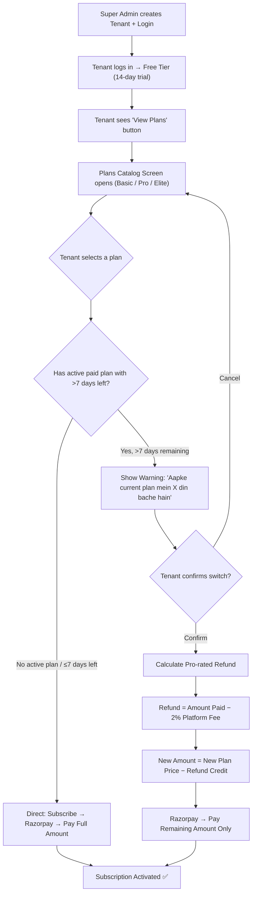

# Plan Switching & Subscription Lifecycle — Complete Implementation Plan

## Overview

This document outlines the full subscription lifecycle for EdTech OS — from tenant creation by Super Admin, through free-tier login, plan selection, payment, and mid-cycle plan switching with pro-rated refund and 2% platform fee.

---

## Subscription Lifecycle Flow



---

## Pro-Rated Refund Calculation (with 2% Platform Fee)

### Formula

```
totalPaidForCurrentPlan    = ₹5000 (example: Pro Quarterly)
totalDaysInCycle           = 90 days (quarterly)
daysUsed                   = 63 days (used)
daysRemaining              = 27 days

unusedValue                = (totalPaidForCurrentPlan ÷ totalDaysInCycle) × daysRemaining
                           = (5000 ÷ 90) × 27 = ₹1500

platformFee (2%)           = totalPaidForCurrentPlan × 0.02
                           = 5000 × 0.02 = ₹100

refundCredit               = unusedValue − platformFee
                           = 1500 − 100 = ₹1400

newPlanPrice               = ₹8000 (example: Elite Quarterly)
amountToPay                = newPlanPrice − refundCredit
                           = 8000 − 1400 = ₹6600 ← Tenant pays this
```

> [!IMPORTANT]
> If `refundCredit > newPlanPrice` (downgrade scenario), the tenant pays ₹0 and the extra credit is **forfeited** (no cash refund). This prevents gaming the system by rapidly switching plans.

---

## Proposed Changes

### Database Migration

#### [NEW] `migrations/0006_plan_switch_tracking.sql`

New columns on `subscriptions` table to track payment and switch history:

| Column | Type | Purpose |
|--------|------|---------|
| `last_payment_amount` | `INT` | Amount paid in the last successful payment (in ₹) |
| `last_payment_date` | `TIMESTAMPTZ` | When the last payment was made |
| `switched_from_plan` | `INT` (FK) | Previous plan_catalog_id (NULL if first plan) |
| `refund_credit_applied` | `INT` | How much credit was deducted from new payment |

---

### Backend API Changes

#### [MODIFY] [razorpay.service.ts](file:///d:/Anees/E-Learning/webapp/backend/src/services/razorpay.service.ts)
- Update `verifyPayment()` to save `last_payment_amount` and `last_payment_date` when payment succeeds.

#### [NEW] Service Function: `switchPlan()` in [plan.service.ts](file:///d:/Anees/E-Learning/webapp/backend/src/services/plan.service.ts)
- **Input:** `tenantId`, `newPlanCatalogId`, `newBillingCycle`
- **Logic:**
  1. Fetch current subscription (status, next_billing_date, last_payment_amount, last_payment_date, billing_cycle)
  2. Calculate `daysRemaining` and `totalDaysInCycle`
  3. Calculate `unusedValue`, `platformFee (2%)`, `refundCredit`
  4. Fetch new plan price based on billing cycle
  5. Calculate `amountToPay = max(0, newPlanPrice - refundCredit)`
  6. Update subscription row: new plan, new billing_cycle, new per_student_rate
  7. Store `switched_from_plan`, `refund_credit_applied`
  8. Return `{ amountToPay, refundCredit, platformFee, newPlanName, preview: true }`

#### [NEW] Route: `POST /api/v1/payment/switch-plan` in [payment.routes.ts](file:///d:/Anees/E-Learning/webapp/backend/src/routes/payment.routes.ts)
- **Two-step flow:**
  1. `POST /api/v1/payment/switch-plan/preview` → Returns calculation preview (no DB change)
  2. `POST /api/v1/payment/switch-plan/confirm` → Actually switches the plan and creates Razorpay order with adjusted amount

---

### Mobile App Changes

#### [MODIFY] [subscription_screen.dart](file:///d:/Anees/E-Learning/mobile/lib/screens/settings/subscription_screen.dart)
- Add **"View Plans"** outlined button below "Pay Now"
- On tap → Navigate to `PlansCatalogScreen`

#### [NEW] `mobile/lib/screens/settings/plans_catalog_screen.dart`
- Premium UI screen that fetches plans from `GET /api/v1/public/plans`
- **Billing Cycle Toggle** (Monthly / Quarterly / Yearly) at the top
- **Plan Cards** with:
  - Plan Name + Tagline
  - Per-student price (changes dynamically with toggle)
  - Feature list with ✅/❌ icons
  - "Subscribe" / "Current Plan" button
- On tapping "Subscribe":
  - If **no active paid plan** (trial/expired) → Directly call switch-plan confirm → Razorpay
  - If **active plan with >7 days left** → Show **Switch Confirmation Bottom Sheet**

#### [NEW] `mobile/lib/widgets/plan_switch_bottom_sheet.dart`
- Shows a beautiful bottom sheet with:
  - Current plan name & days remaining
  - ⚠️ Warning: *"Aapke current plan mein X din bache hain"*
  - Refund calculation breakdown:
    - Unused value: ₹XXX
    - Platform fee (2%): −₹XX
    - Credit applied: ₹XXX
    - **Amount to pay: ₹XXXX**
  - "Cancel" and "Confirm Switch" buttons
- On Confirm → calls `/switch-plan/confirm` → opens Razorpay with adjusted amount

---

## Edge Cases Handled

| Scenario | Behavior |
|----------|----------|
| **Trial user** picks first plan | No refund calc. Direct payment for full plan amount |
| **Active plan, ≤7 days left** | No refund calc. Direct payment for new plan (old expires naturally) |
| **Active plan, >7 days left** | Pro-rated refund with 2% fee deducted. Adjusted payment |
| **Downgrade (credit > new price)** | Tenant pays ₹0. Extra credit forfeited. Plan switches immediately |
| **Same plan selected** | Button shows "Current Plan" (disabled). Cannot re-subscribe to same plan |
| **Expired/past_due** | Treated same as trial — no refund, full payment for new plan |

---

## Verification Plan

### Automated Tests
- `npm run test` — ensure new service functions pass unit tests

### Manual Verification
1. Login as tenant on trial → View Plans → Subscribe to Basic → Verify Razorpay opens with full amount
2. After subscribing, go back to View Plans → Switch to Pro → Verify warning shows with correct refund math
3. Confirm switch → Verify Razorpay opens with adjusted amount
4. After payment → Verify subscription_screen shows new plan with correct next_billing_date
5. Check `subscriptions` table for `last_payment_amount`, `switched_from_plan`, `refund_credit_applied`
